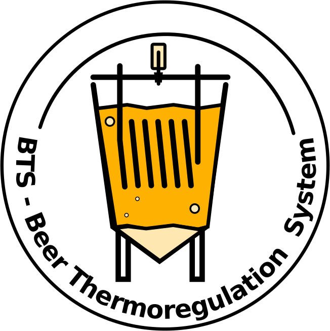
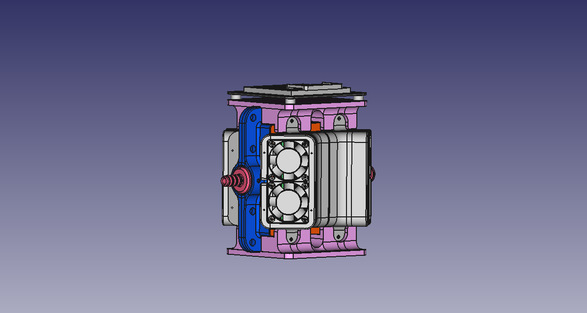
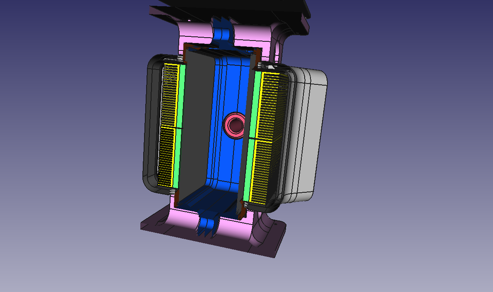

# Index
- [Index](#index)
- [BeerThermoregulationSystem](#beerthermoregulationsystem)
- [Subprojects/Components](#subprojectscomponents)
- [Power specs and power supply requirements](#power-specs-and-power-supply-requirements)
  - [Power supply minimum requirements](#power-supply-minimum-requirements)
- [Heat exchanger body](#heat-exchanger-body)

# BeerThermoregulationSystem

    

Beer thermoregulation system based on Peltier devices. Embeds mechanical design and electronic designs (as submodules)
This project aims to provide a complete electo-mechanical design whose role is to regulate fermenting beer temperature, using water-based heat exchanger.

# Subprojects/Components
It comes with 3 main hardware components (as opposed to 4 at the early days of the design) :
* Main heat exchanger body with 3D Cad design and 3D printed enclosures.
* [BTS-LogicBoard](https://github.com/bebenlebricolo/BTS-LogicBoard/blob/main/Readme.md) : electronic logic board whose role is to drive the power board with appropriate signals. It is full-featured and I designed it in a way that allows further improvements and extensions.
  * 
* [BTS-MainBoard-Power](https://github.com/bebenlebricolo/BTS-MainBoard-Power/blob/main/Readme.md) : this electronic board drives the 8 Peltier modules used in this project and effectively acts as the main temperature regulation actuator. It was designed to work at relatively high frequencies (> 1MHz ) in order to reduce the overall board size and components price.
  * 

# Power specs and power supply requirements
Each Peltier module (12v, 40x40 mm TEC12706, [manufacturer datasheet](https://docs.rs-online.com/aeb0/A700000007895121.pdf)) is able to draw 6.4Amps and move 57W each, which is the absolute maximum ratings for these devices ; in reality their efficiency is much lower, which explains the numbers !
The power board itself was designed to handle 40 Amps DC @ 12Volts (hence 480 W), in order to feed those 8 Peltier modules with around 5 Amps each, in both cooling and heating directions.

## Power supply minimum requirements
For my tests, I'm using a beefy PC ATX power supply (12V, 40Amps max) with around 600W capabilities.
These board setup is running it to its very limits and I think that's not a good idea on the long run.
So the PSU should be at least this powerful and able to deliver 40A+ steady DC current at 12V.

# Heat exchanger body

